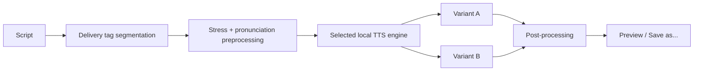

<div align="center">
  

  # Voxena

  **A local multi-engine AI voice studio for Windows.**  
  Clone voices, use built-in speakers, control delivery with inline tags, and render locally on your own GPU.

  [](#)
  [](#)
  [](#)
  [](#)
  [](#)

  **English** · [Русская версия](README_RU.md)

  <br>

  *Made by Rider*
</div>

---

## ✨ What is Voxena?

Voxena is a Windows desktop voice studio built around **local AI speech synthesis**. It provides one unified interface for several modern TTS engines instead of locking you into a single model or cloud service.

Choose a built-in voice or create a reusable custom voice from an audio reference, write a script, add delivery cues, and Voxena renders **two takes with different seeds** so you can immediately compare them side by side.

Your scripts, voice references, cached voice conditioning and generated audio stay on your PC. Internet access is used only when Voxena needs to download the models and runtime components you choose.

### Highlights

- 🎙️ **Reusable voice cloning** from WAV, MP3, FLAC, OGG, M4A, AAC and OPUS references.
- 🧠 **Six independent TTS engines**, each isolated in its own Python environment.
- 🎭 **Segment-aware delivery tags** for emotion, whispering, speed, narration, pauses, laughter, sighs and more.
- 🔤 **Russian stress assistance** with a compact local Gemma 4 helper and manual stress marking.
- 🎚️ **Stability, speed and pitch controls**, normalization and silence trimming.
- 🎲 **Two variants per render** with different seeds, displayed side by side.
- 🖱️ **Drag & Drop** audio import with visual feedback.
- 💾 Unsaved takes live in a **temporary cache** instead of permanently cluttering the output folder.
- 🌗 **Light and dark themes**.
- 🌍 Interface languages: **English, Russian and Ukrainian**.
- 🔒 **Local-first by design** — no cloud synthesis pipeline is required.

---

## 🎛️ Supported engines

Voxena does not force one “best” model on every task. Install only the engines you want and switch between them from the same UI.

| Engine | Best for | Languages | Suggested VRAM | Clone transcript | Upstream license |
|---|---|---:|---:|---|---|
| **CosyVoice 3** | Natural multilingual speech, strong speaker similarity | 9, incl. Russian | 8–12 GB | Required | Apache-2.0 |
| **Fish Speech S2 Pro 4B** | High realism, expressive delivery, native fine-grained tags | 83 | 24 GB | Required | Fish Audio Research License |
| **XTTS v2** | Lightweight multilingual cloning and fast setup | 17, incl. Russian | 6–8 GB | Optional | Coqui Public Model License |
| **F5-TTS Russian** | High-quality Russian / English voice cloning | Russian + English | 8 GB | Required | CC BY-NC-SA 4.0 |
| **Qwen3-TTS 1.7B** | High-fidelity cloning + built-in premium voices | 10, incl. Russian | 8–12 GB | Required for high-fidelity clone | Apache-2.0 |
| **Chatterbox Multilingual V3** | Conversational zero-shot cloning | 23, incl. Russian | 6–8 GB | Optional | MIT |

> [!IMPORTANT]
> The models have **different licenses**. Some restrict commercial use. Always review the upstream license for the model you use before publishing or monetizing generated audio. See [`THIRD_PARTY_NOTICES.md`](THIRD_PARTY_NOTICES.md) for project notes.

---

## 🎙️ Voice cloning

Creating a custom voice is intentionally model-aware. Voxena asks you to select the target engine first and then shows the reference requirements for that engine.

For models that support reusable conditioning, Voxena prepares the voice once and stores the result locally. That means you do **not** need to re-analyze the original clip every time you synthesize new text.

Typical reference recommendations:

- use **one clean speaker**;
- avoid music, room reverb and overlapping voices;
- keep the reference reasonably short and representative of the target voice;
- provide an **exact transcript** when the selected model requires alignment.

The transcript field is hidden automatically for models that do not need it.

Custom voice data is stored under:

```text
Voices\Custom\<voice-id>
```

Deleting one custom voice removes only that voice and its prepared conditioning — installed models and other voices remain untouched.

---

## 🎭 Delivery tags

Voxena treats delivery tags as **states on a timeline**, not as one global instruction for the entire script.

### Sequential states

```text
[sad] I thought this would work...
[angry] But now I'm done waiting.
```

The first span is rendered as sad. The second span switches to angry.

### Adjacent tags stack

```text
[sad][whisper] I don't want them to hear us.
```

Because there is no spoken text between the two tags, both apply to the same segment.

### Reset to neutral

```text
[excited] We actually did it!
[normal] Anyway, back to the report.
```

`[normal]` clears the active delivery state for the following text.

### Timeline events

```text
I really thought it would work... [sighs]
But apparently not. [pause:1.0]
[angry] So let's fix it properly.
```

`[sighs]`, `[laughs]` and `[pause:x]` are timeline events rather than persistent emotional styles.

### Available tag families

| Category | Examples |
|---|---|
| **Emotion** | `[happy]` `[excited]` `[sad]` `[angry]` `[calm]` `[serious]` `[sarcastic]` `[empathetic]` |
| **Delivery** | `[whisper]` `[soft]` `[loud]` `[slow]` `[fast]` `[deep]` `[bright]` `[narration]` |
| **Events / control** | `[pause:0.7]` `[laughs]` `[sighs]` `[normal]` |

English, Russian and Ukrainian aliases are supported. For example, `[sad]`, `[грустно]` and `[сумно]` resolve to the same semantic style.

> Tag support is adapted to each engine. Engines with native semantic controls receive their native format; other engines use Voxena's safe fallback controls without globally changing the speaker's pitch for ordinary emotion tags.

---

## 🔤 Russian stress & pronunciation preprocessing

Russian pronunciation can be sensitive to stress placement, especially in cloned voices. Voxena includes a compact **local Gemma 4 stress helper** that marks stressed vowels internally before synthesis.

You can also mark stress manually:

1. Select a single vowel in the editor.
2. Press the **`´`** button.
3. Voxena treats that vowel as the user's explicit stress choice.

A manually marked word is protected from receiving a second automatic stress mark. Automatic stress is resolved first, then Voxena performs its phonetic normalization pass before sending the final text to the selected speech engine.

The visible script stays readable — the internal preprocessing representation is not written back over your text.

---

## 🎚️ Rendering workflow



For each generation Voxena creates **two variants with different seeds**. You can listen to both immediately, inspect their waveform, save either one, or generate another pair.

Available output formats:

- **MP3**
- **WAV PCM**
- **FLAC**
- **OGG**
- **M4A AAC**

Additional audio settings include 44.1 / 48 kHz sample rate, lossy bitrate selection, loudness normalization and edge-silence trimming.

---

## 🧩 Isolated runtimes

Modern speech projects frequently require incompatible combinations of Python, PyTorch, Transformers and auxiliary libraries. Voxena avoids forcing them into one environment.

Each engine receives its own runtime under:

```text
Runtime\Engines\<engine-id>
```

This allows, for example, one model to use a specific Transformers release without silently breaking another model that expects a different one.

Voxena also performs runtime compatibility checks and can repair known dependency drift before synthesis.

---

## 📁 Local data layout

All application data is stored relative to `Voxena.exe`.

```text
Voxena.exe
├─ Models\              # downloaded model weights
├─ Runtime\             # uv, FFmpeg, Python runtimes and engine environments
├─ Voices\Custom\       # cloned voices and prepared conditioning
├─ Cache\Generated\     # temporary unsaved render previews
├─ Output\              # default Save as... destination
├─ Config\              # application settings
└─ Logs\                # diagnostic logs
```

Temporary previews are cleaned instead of being permanently accumulated in `Output` when you never chose to save them.

---

## 🚀 First launch

On the first run Voxena opens a model chooser. You may install one or several engines immediately, or skip the step and use **Models** later.

Each model card shows:

- approximate disk usage;
- recommended VRAM;
- language coverage;
- license;
- strengths and trade-offs;
- reference requirements for cloning.

The compact Russian stress helper is prepared automatically when needed.

---

## 🛠️ Building from source

### Requirements

- Windows 10 / 11 x64
- Visual Studio 2022 or Build Tools 2022
- .NET desktop build tools workload
- Internet access for NuGet restore and first-time runtime/model downloads

### One-command release build

```bat
BuildRelease.bat
```

The build output is written to:

```text
Voxena\bin\Release
```

For a clean release archive:

```bat
PackageRelease.bat
```

For development builds you can also use:

```bat
BuildDebug.bat
```

or:

```bat
BuildAndRun.bat
```

End users do not need Visual Studio, Python or a manually configured ML environment. Voxena prepares the required managed runtimes for the engines selected inside the application.

---

## 🔐 Privacy

Voxena is designed around local inference:

- scripts are processed locally;
- cloned voice references remain local;
- prepared speaker conditioning remains local;
- generated audio remains local;
- model runtimes are stored beside the application.

Network access is required for downloading selected model packages and their dependencies. Voxena does not require a cloud TTS account for normal synthesis.

---

## ⚠️ Responsible use

Voice cloning can convincingly reproduce a person's vocal identity. Use it only when you have the necessary permission and do not use generated speech to impersonate, defraud, harass or mislead people.

Model-specific usage restrictions still apply independently of Voxena.

---

<div align="center">

### Voxena
**Local voices. Multiple engines. One studio.**

[Русская версия](README_RU.md) · [`CHANGELOG.md`](CHANGELOG.md) · [`THIRD_PARTY_NOTICES.md`](THIRD_PARTY_NOTICES.md)

Made by **Rider**

</div>
